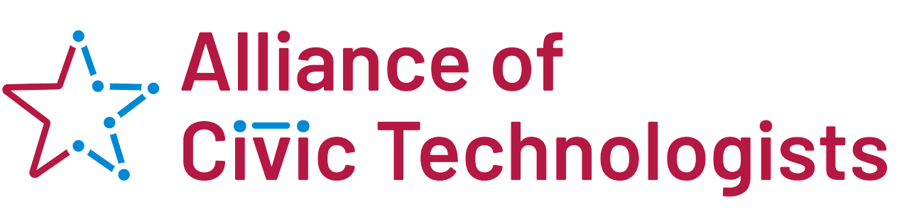

| [Home](README.md) | [About](about.md) | [News](news.md) | [Join](join.md) |

# Alliance of Civic Technologists

## We are thrilled to announce the formation of the Alliance of Civic Technologists (ACT).

---

**🎉 Latest Update (June 13, 2023):**
[ACT June Newsletter](news.md)

---

The Alliance of Civic Technology (ACT) is a newly formed organization that will connect volunteer civic technology efforts, in both technology and advocacy, in their local communities. Our initial goal is to ensure the continuity and growth of civic technology volunteer communities across the United States, launching immediately to fill the gap left by the sunsetting of Code for America’s Brigade program. [Learn more about ACT](about.md).

---

### Join our mailing list!
#### To stay in touch and/or join our efforts, sign up for our mailing list.
[Join our mailing list](https://eepurl.com/ithxXU)

---

### Donate today!
#### To support our efforts financially, donations can be made on our Open Collective.
[Donate to ACT](https://opencollective.com/act-fund)

---

**Alliance of Civic Technologists**
ACT is a decentralized network of civic tech volunteer organizations.

---

| [Home](README.md) | [News](news.md) | [Donate](https://opencollective.com/act-fund) | [Mailing List](https://eepurl.com/ithxXU) |

| [Code of Conduct](code-of-conduct.md) | [Discord](https://discord.gg/RP6jXM43fY) | [Email](mailto:hello@civictechnologists.org) | [LinkedIn](https://www.linkedin.com/company/alliance-of-civic-technologists) |

| [Mastodon](https://mastodon.social/@allianceofcivictechnologists) | [Twitter](https://twitter.com/alliescivictech) |
